# MySQL + Navicat 教务数据库实践：四表设计、选课成绩与先修课程

> 《数据库系统基础》实践记录 | MySQL 8.0.43 + Navicat Premium + GitHub

本项目从零创建一个简化的学生选课数据库 `school_db`，完整记录 **数据库连接、图形化建表、主键与联合主键、外键与自引用外键、测试数据、连接查询、Navicat 逆向建模**。初始版本包含系、学生、课程三张表；根据课堂要求，第二阶段增加选课表 `sc` 和课程先修关系 `cpno`。

- **可直接复现的完整 SQL**：[`sql/school_db.sql`](sql/school_db.sql)
- **全部实验查询 SQL**：[`sql/queries.sql`](sql/queries.sql)
- **Navicat 最新原始导出文件**：[`sql/navicat-exports/school_db_latest.sql`](sql/navicat-exports/school_db_latest.sql)

> **运行提醒**：`sql/school_db.sql` 是完整重建脚本，包含 `DROP TABLE IF EXISTS`，会删除 `school_db` 中同名表和原有数据。不要在存有重要数据的数据库中运行。`sql/queries.sql` 仅用于查询。

## 一、实验目的与环境

本实验旨在熟悉 MySQL 与 Navicat 的基本操作，理解关系模型、实体完整性、参照完整性以及常见 SQL 查询。实验环境：**Windows、MySQL 8.0.43、Navicat Premium、localhost:3306、utf8mb4 / utf8mb4_0900_ai_ci**。以下测试数据为课堂演示数据，截图为实际操作结果。

本项目分为两期：

1. **一期：三表基础练习**——创建 `department`、`student`、`course`，完成主外键与基础 `INNER JOIN`。
2. **二期：选课与先修课扩展**——增加 `sc`、`course.cpno`，设置联合主键及自引用外键，练习 `LEFT JOIN` 自连接。

## 二、关系模式与字段设计

### 2.1 系表 department

| 字段 | 类型 | 约束 | 含义 |
| --- | --- | --- | --- |
| `dept_id` | `CHAR(4)` | 主键、非空 | 系编号 |
| `dept_name` | `VARCHAR(50)` | 非空、唯一索引 | 系名称 |
| `office` | `VARCHAR(100)` | 允许 NULL | 办公室 |

创建时先在 Navicat 设计字段与主键，再通过「索引」设置 `uq_dept_name` 唯一索引。

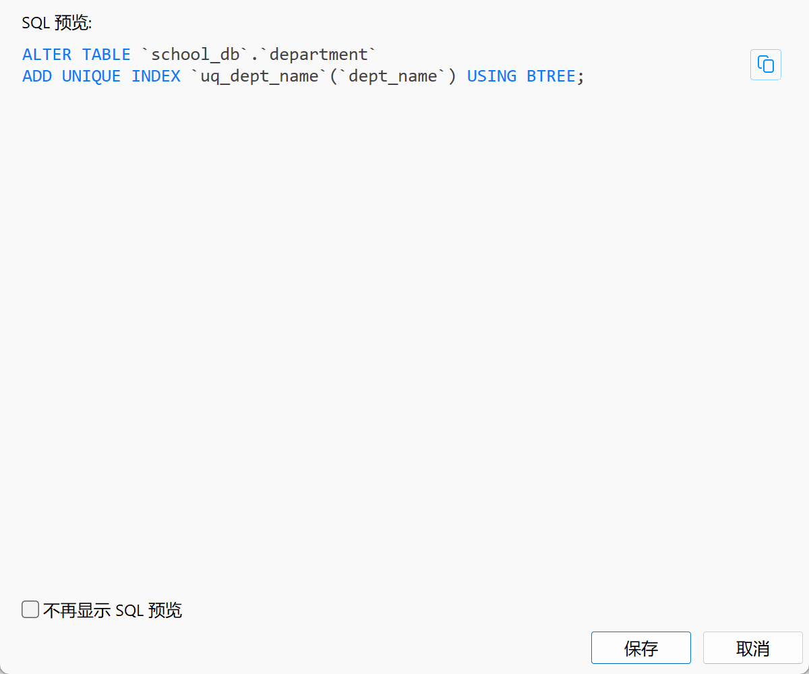

### 2.2 学生表 student

| 字段 | 类型 | 约束 | 含义 |
| --- | --- | --- | --- |
| `student_id` | `CHAR(10)` | 主键 | 学号 |
| `student_name` | `VARCHAR(30)` | 非空 | 姓名 |
| `gender` | `CHAR(1)` | 允许 NULL | 性别 |
| `age` | `TINYINT UNSIGNED` | 允许 NULL | 年龄 |
| `dept_id` | `CHAR(4)` | 外键、非空 | 所属系编号 |

`student.dept_id` 引用 `department.dept_id`；外键配置为 `ON DELETE RESTRICT ON UPDATE CASCADE`。

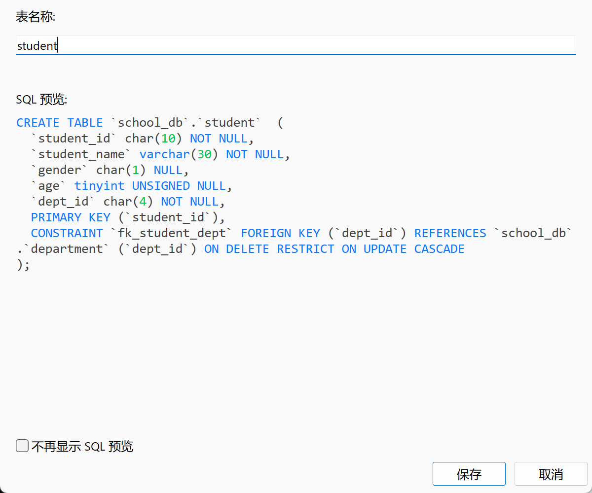

### 2.3 课程表 course（含先修课）

| 字段 | 类型 | 约束 | 含义 |
| --- | --- | --- | --- |
| `course_id` | `CHAR(6)` | 主键 | 课程号 |
| `course_name` | `VARCHAR(60)` | 非空 | 课程名 |
| `credits` | `DECIMAL(3,1)` | 非空 | 学分 |
| `dept_id` | `CHAR(4)` | 外键、非空 | 开课系编号 |
| `cpno` | `CHAR(6)` | 自引用外键、允许 NULL | 直接先修课编号 |

`course.cpno` 引用同一张表的 `course.course_id`，采用 `ON DELETE SET NULL ON UPDATE CASCADE`。基础课程没有直接先修课时，`cpno` 为 `NULL`。该模型只能存储**一门直接先修课**，如果某课程需要多门先修课，应另建课程先修关系表。

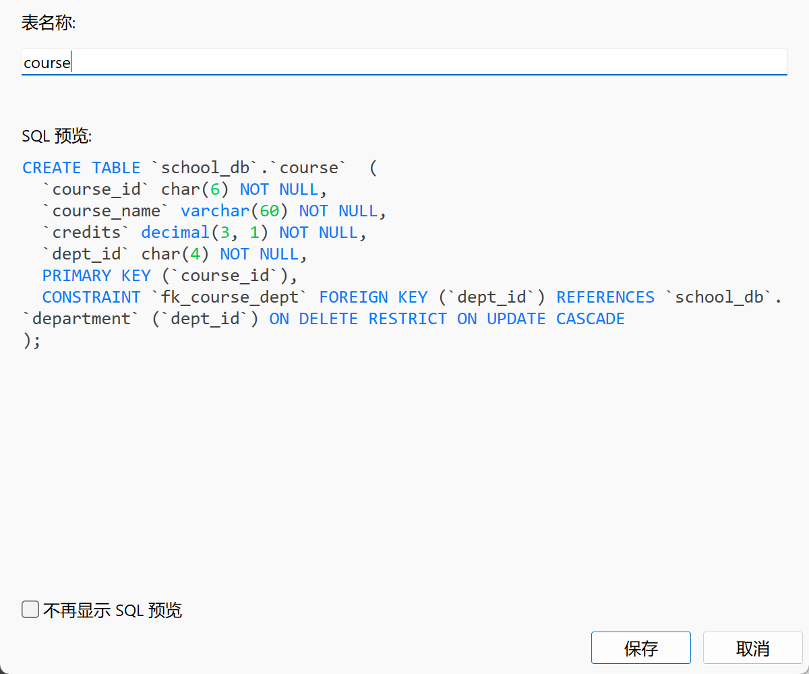

### 2.4 选课表 sc（联合主键）

| 字段 | 类型 | 约束 | 含义 |
| --- | --- | --- | --- |
| `student_id` | `CHAR(10)` | 联合主键成员、外键 | 学号 |
| `course_id` | `CHAR(6)` | 联合主键成员、外键 | 课程号 |
| `grade` | `DECIMAL(5,2)` | 允许 NULL | 成绩 |

联合主键是 **`PRIMARY KEY (student_id, course_id)`**，意味着同一个学生和同一门课程的组合只能出现一次，学号或课程号分别允许重复。外键 `fk_sc_student` 指向学生表、`fk_sc_course` 指向课程表，表达学生和课程的多对多关联。

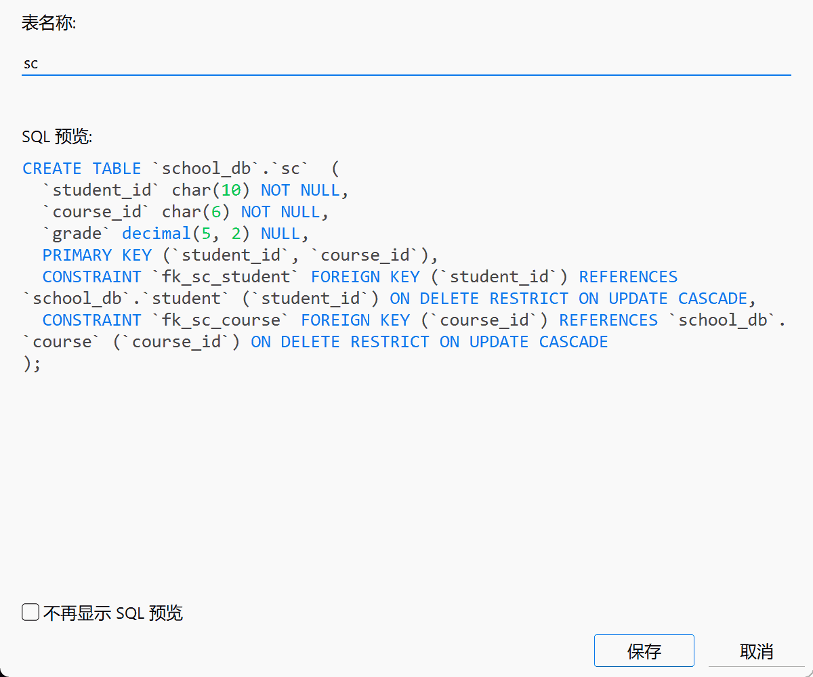

### 2.5 五条外键关系

| 外键（引用方） | 目标（被引用方） | 用途 |
| --- | --- | --- |
| `student.dept_id` | `department.dept_id` | 学生所属系 |
| `course.dept_id` | `department.dept_id` | 课程开设系 |
| `sc.student_id` | `student.student_id` | 选课学生 |
| `sc.course_id` | `course.course_id` | 所选课程 |
| `course.cpno` | `course.course_id` | 课程直接先修课（自引用） |

判断外键方向的规则：**`FOREIGN KEY (本表字段) REFERENCES 被引用表(被引用字段)`**。引用方存储别的表定义的编号，被引用方提供编号的合法集合。

## 三、Navicat 逆向建模：四表关系图

利用 Navicat 的「逆向数据库到模型」功能，得到四张表的真实关系图：

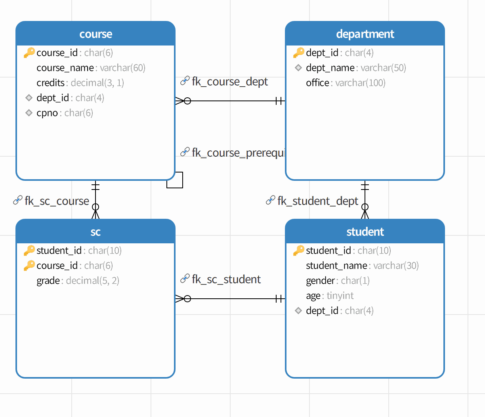

图中黄色钥匙表示主键，`sc` 的两个黄色钥匙表示联合主键；`fk_course_prerequisite` 对应 `course` 的自引用连线。旧版三表关系图保留在 [`images/09-er-diagram.png`](images/09-er-diagram.png)，用于对比数据库的扩展过程。

## 四、操作步骤与实际数据

### 4.1 建库与建表

在 Windows 服务中确认 `MySQL80` 正在运行，然后在 Navicat 中使用 `localhost:3306` 连接 MySQL。右键连接创建 `school_db`，字符集 `utf8mb4`、排序规则 `utf8mb4_0900_ai_ci`。在「新建表」中逐个配置字段、主键与外键，使用「设计表」和「索引」设置约束。

通过 SQL 建库亦可：

```sql
CREATE DATABASE IF NOT EXISTS school_db
DEFAULT CHARACTER SET utf8mb4 COLLATE utf8mb4_0900_ai_ci;
USE school_db;
```

建表与数据的**完整执行脚本**见 [`sql/school_db.sql`](sql/school_db.sql)。

### 4.2 系、学生与课程基础数据

首次练习插入了 **3 个系、4 名学生和 4 门课程**；后续增加两门基础课程，总计 **6 门课程**。

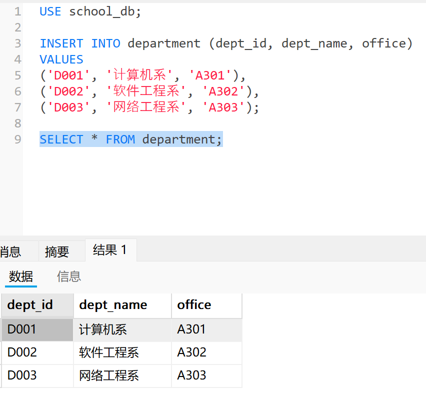

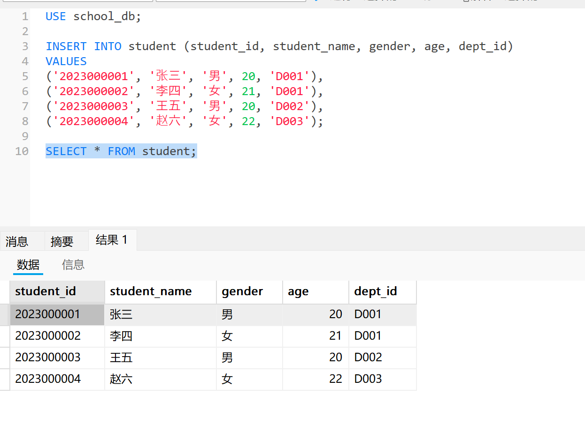

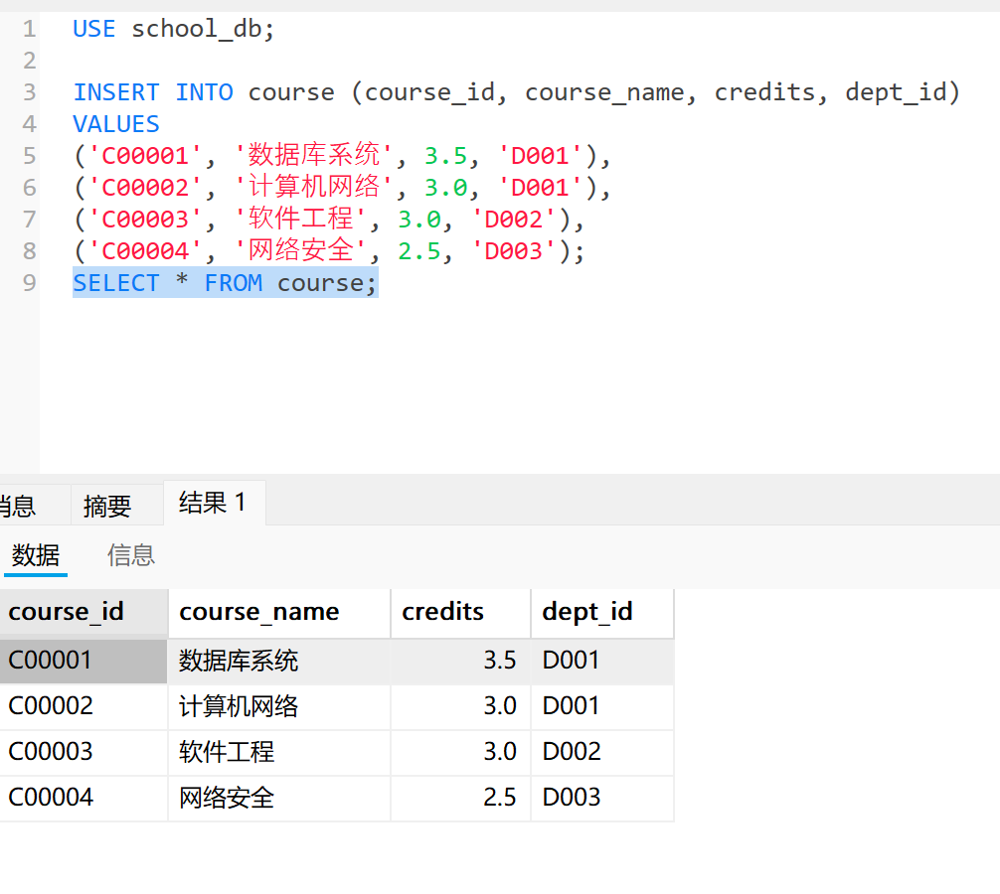

### 4.3 SC 选课数据


```sql
INSERT INTO sc (student_id, course_id, grade) VALUES
('2023000001', 'C00001', 85.50),
('2023000001', 'C00002', 92.00),
('2023000002', 'C00001', 88.00),
('2023000002', 'C00003', 90.50),
('2023000003', 'C00003', 86.00),
('2023000004', 'C00004', 91.00);
```

`SELECT * FROM sc;` 返回 **6 条选课记录**：

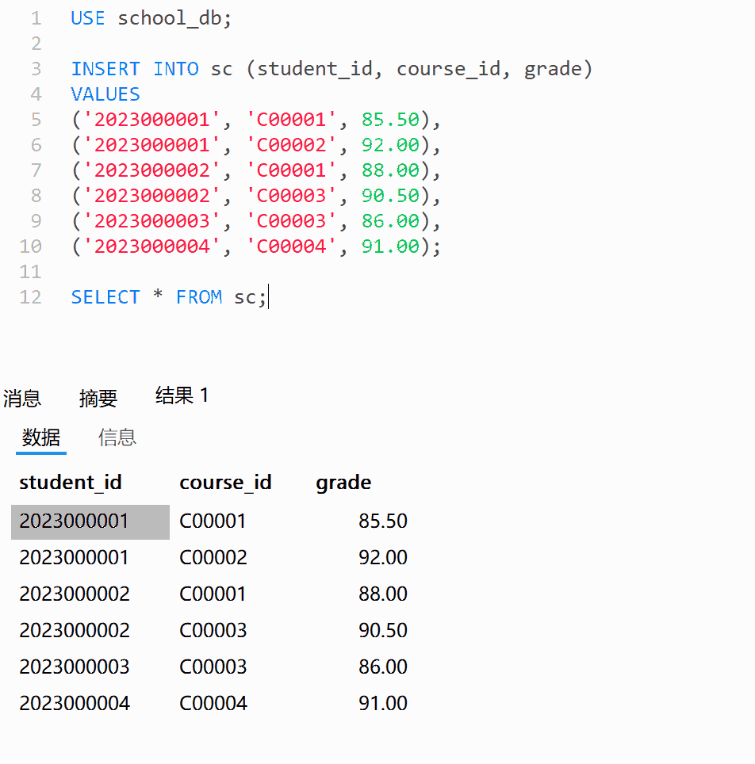

### 4.4 直接先修课数据

增加 `C00005`（程序设计基础）、`C00006`（数据结构），再更新现有课程的 `cpno`：

```sql
UPDATE course SET cpno = 'C00005' WHERE course_id = 'C00006';
UPDATE course SET cpno = 'C00006' WHERE course_id IN ('C00001', 'C00002');
UPDATE course SET cpno = 'C00002' WHERE course_id = 'C00004';
```

例如：程序设计基础 → 数据结构 → 数据库系统；网络安全的直接先修课是计算机网络。

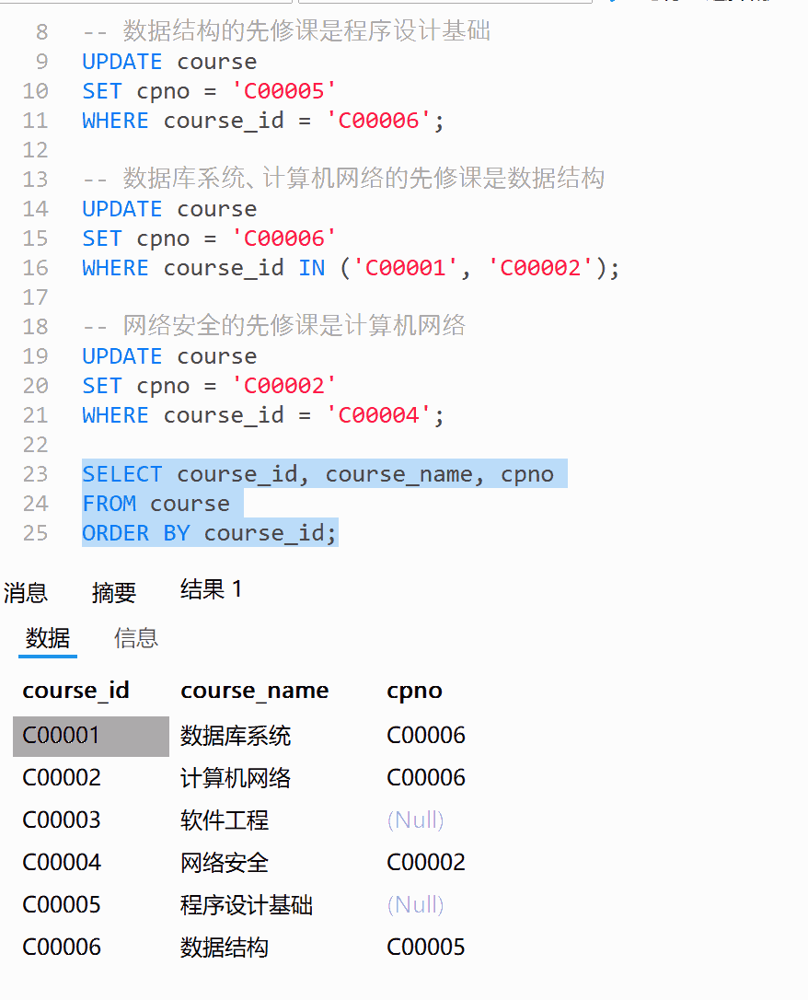

## 五、SQL 查询练习

### 5.1 INNER JOIN：学生所属系

```sql
SELECT s.student_id AS 学号, s.student_name AS 姓名, d.dept_name AS 所属系
FROM student AS s
INNER JOIN department AS d ON s.dept_id = d.dept_id;
```

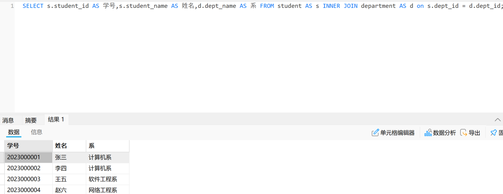

`ON` 描述两个表按什么字段匹配，`WHERE` 通常用于筛选结果；在内连接中等值条件写在两处常可等价，但在外连接中二者可能导致不同结果。

### 5.2 SC 多表连接：学生、课程和成绩

```sql
SELECT s.student_name AS 学生姓名, c.course_name AS 课程名称, sc.grade AS 成绩
FROM sc
JOIN student AS s ON sc.student_id = s.student_id
JOIN course AS c ON sc.course_id = c.course_id;
```


### 5.3 LEFT JOIN 自连接：课程及直接先修课

```sql
SELECT c.course_id AS 课程编号, c.course_name AS 课程名称,
       p.course_name AS 先修课程
FROM course AS c
LEFT JOIN course AS p ON c.cpno = p.course_id
ORDER BY c.course_id;
```

同一张 `course` 表通过 `c` 和 `p` 两个别名扮演当前课程与先修课程两个角色。使用 `LEFT JOIN` 可以保留没有先修课的课程（先修名称为 `NULL`）。

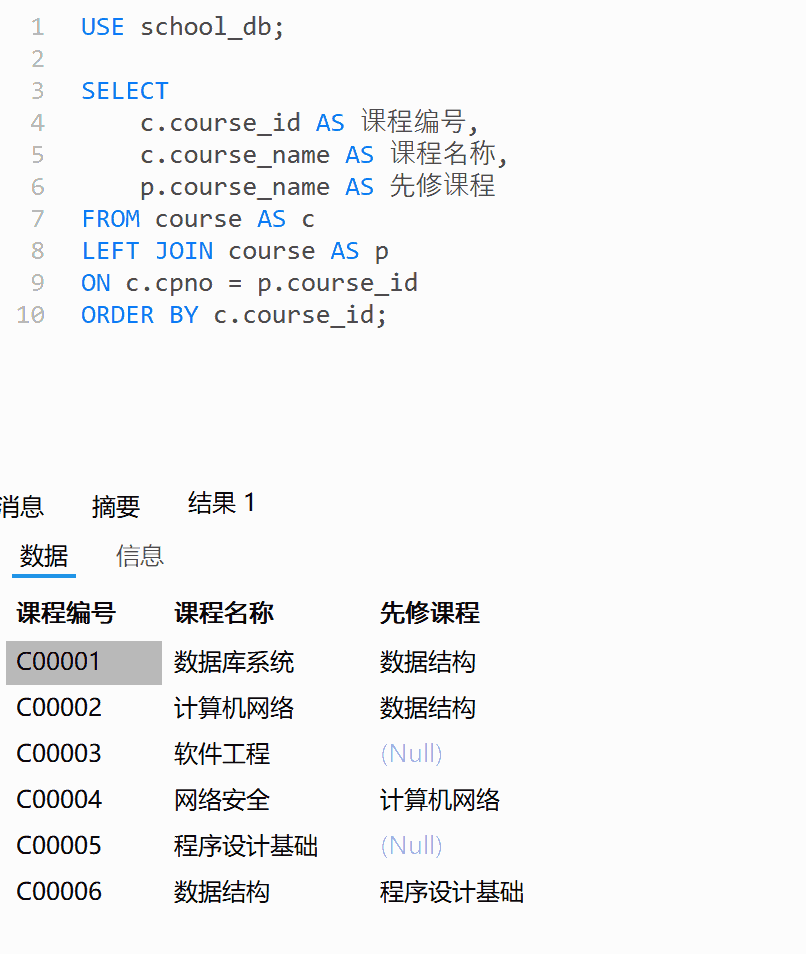

### 5.4 进阶查询：间接先修课

```sql
SELECT c.course_name AS 当前课程, p.course_name AS 直接先修课,
       pp.course_name AS 间接先修课
FROM course AS c
JOIN course AS p ON c.cpno = p.course_id
JOIN course AS pp ON p.cpno = pp.course_id;
```

两次自连接可查询两级先修关系，例如数据库系统 → 数据结构 → 程序设计基础。**该语句是额外的扩展练习，未作为已实测结果描述。** 更深层级可以进一步研究递归 CTE。

## 六、实验总结

本次实验从原来的三表模型扩展为四表模型，重点认识了三个关系数据库概念：

1. **联合主键**：`sc` 中学号与课程号共同标识一条选课记录，单独任一字段都可能重复。
2. **外键的引用方向**：`sc.student_id` 引用 `student.student_id`，`sc.course_id` 引用 `course.course_id`，由引用方保存被引用方定义的编号。
3. **自引用外键与自连接**：`course.cpno` 指向 `course.course_id`，查询时使用两个别名表示当前课程与先修课程，并可借助 `LEFT JOIN` 保留没有先修课的课程。


## 七、文件目录与复现方式

```text
sql-exercise/
├── README.md
├── images/
│   ├── 01-database-created.png
│   ├── 02-department-unique-index.png
│   ├── 03-student-table-design.png
│   ├── 04-course-table-design.png
│   ├── 05-department-query.png
│   ├── 06-student-query.png
│   ├── 07-course-query.png
│   ├── 08-inner-join.png
│   ├── 09-er-diagram.png
│   ├── 10-sc-design.png
│   ├── 11-sc-data.png
│   ├── 12-course-prerequisites.png
│   ├── 13-course-self-join.png
│   └── 14-four-table-er.png
└── sql/
    ├── school_db.sql                 # 按外键依赖顺序重建四张表与数据
    ├── queries.sql                   # 查询语句
    └── navicat-exports/
        ├── department.sql            # 一期的单表原始导出
        ├── student.sql
        ├── course.sql
        └── school_db_latest.sql      # 二期四表 Navicat 原始完整导出
```


