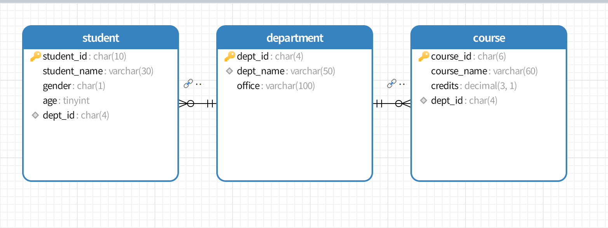

# MySQL + Navicat 实践：创建学生表、系表与课程表

> 数据库系统基础课程实践：从连接 MySQL、设计关系模式，到利用 Navicat 创建数据表、配置主外键、插入数据、执行连接查询及生成关系模型图。

## 一、实验目的与环境

本实验以简化的高校教务数据库为案例，使用 MySQL 存储数据、Navicat Premium 进行图形化管理，完成以下任务：

1. 建立 `school_db` 数据库，理解字符集与排序规则的作用。
2. 设计 `department`、`student`、`course` 三张关系表，确定字段类型及主键。
3. 设置外键与唯一索引，验证表之间的参照关系。
4. 插入测试记录，使用 `SELECT` 和 `INNER JOIN` 查询数据。
5. 使用 Navicat 逆向建模，将数据库表结构转换为可视化关系图。

**本次使用的环境**：Windows、MySQL **8.0.43**、Navicat Premium，连接地址 `localhost:3306`；数据库字符集 `utf8mb4`，排序规则 `utf8mb4_0900_ai_ci`。SQL 语句和截图均来自本次实际操作。

## 二、数据库设计

### 2.1 需求分析

数据库包含以下三类实体：

- **系（department）**：记录系编号、系名称和办公室地点。
- **学生（student）**：记录学号、姓名、性别、年龄和所属系编号。
- **课程（course）**：记录课程编号、课程名称、学分及开课系编号。

在本次简化模型中，一个系可以包含多名学生，也可以开设多门课程；每名学生只归属于一个系，每门课程只归属于一个开课系。因此存在两个 **1:N** 关系。

> **建模边界**：本次仅要求三张表，所以没有建立“学生—课程”的选课关系。如果需要记录某名学生选修了哪些课程，应再增加 `SC` / `student_course` 选课表，建立学生与课程之间的多对多联系。

### 2.2 数据表结构

**系表 `department`**

| 字段 | 类型 | 约束 | 含义 |
| --- | --- | --- | --- |
| `dept_id` | `CHAR(4)` | PRIMARY KEY, NOT NULL | 系编号 |
| `dept_name` | `VARCHAR(50)` | NOT NULL, UNIQUE | 系名称 |
| `office` | `VARCHAR(100)` | 可为 NULL | 办公地点 |

**学生表 `student`**

| 字段 | 类型 | 约束 | 含义 |
| --- | --- | --- | --- |
| `student_id` | `CHAR(10)` | PRIMARY KEY, NOT NULL | 学号 |
| `student_name` | `VARCHAR(30)` | NOT NULL | 学生姓名 |
| `gender` | `CHAR(1)` | 可为 NULL | 性别 |
| `age` | `TINYINT UNSIGNED` | 可为 NULL | 年龄 |
| `dept_id` | `CHAR(4)` | NOT NULL, FOREIGN KEY | 所属系编号 |

**课程表 `course`**

| 字段 | 类型 | 约束 | 含义 |
| --- | --- | --- | --- |
| `course_id` | `CHAR(6)` | PRIMARY KEY, NOT NULL | 课程编号 |
| `course_name` | `VARCHAR(60)` | NOT NULL | 课程名称 |
| `credits` | `DECIMAL(3,1)` | NOT NULL | 学分 |
| `dept_id` | `CHAR(4)` | NOT NULL, FOREIGN KEY | 开课系编号 |

设计时使用 `CHAR` 存储固定长度的编号，`VARCHAR` 存储变长文本；`DECIMAL(3,1)` 适合保存 `3.5`、`4.0` 等精确到一位小数的学分。

### 2.3 表关系图



图中黄色钥匙标识主键，关系线体现：

- `student.dept_id` → `department.dept_id`（一个系对应多个学生）；
- `course.dept_id` → `department.dept_id`（一个系对应多门课程）。

这张图由 Navicat 对已建数据库进行**逆向建模**生成，而非手动画出的示意图。

## 三、使用 Navicat 创建数据库与表

### 3.1 连接 MySQL 并创建数据库

在 Windows 服务中确认 MySQL 服务已运行。打开 Navicat Premium，创建 MySQL 连接，使用 `localhost`、端口 `3306` 和本地数据库账号连接。随后创建数据库 `school_db`，设置字符集为 `utf8mb4`，排序规则为 `utf8mb4_0900_ai_ci`。


同样可以使用 SQL：

```sql
CREATE DATABASE IF NOT EXISTS school_db
DEFAULT CHARACTER SET utf8mb4
COLLATE utf8mb4_0900_ai_ci;
USE school_db;
```

### 3.2 创建系表并添加唯一索引

在 Navicat 的“新建表”界面中设置 `dept_id`、`dept_name` 和 `office`，把 `dept_id` 指定为主键；随后为 `dept_name` 添加唯一索引 `uq_dept_name`，防止在该表中重复使用相同的系名称。

```sql
CREATE TABLE department (
    dept_id CHAR(4) PRIMARY KEY,
    dept_name VARCHAR(50) NOT NULL UNIQUE,
    office VARCHAR(100)
) ENGINE=InnoDB DEFAULT CHARSET=utf8mb4;
```

以下是通过 Navicat 增加唯一索引的 SQL 预览：


### 3.3 创建学生表与外键

学生表使用 `student_id` 作为主键，`dept_id` 作为外键，关联 `department.dept_id`。设置的约束如下：

```sql
CONSTRAINT fk_student_dept
FOREIGN KEY (dept_id)
REFERENCES department(dept_id)
ON DELETE RESTRICT
ON UPDATE CASCADE
```

其中 `RESTRICT` 防止删除仍有学生引用的系，`CASCADE` 表示更新系编号时相应更新关联学生记录中的系编号。


### 3.4 创建课程表与外键

课程表使用 `course_id` 作为主键，`dept_id` 同样引用系表中的 `dept_id`：

```sql
CONSTRAINT fk_course_dept
FOREIGN KEY (dept_id)
REFERENCES department(dept_id)
ON DELETE RESTRICT
ON UPDATE CASCADE
```

`credits` 采用 `DECIMAL(3,1)`，表示总共最多 3 位十进制数字，其中小数部分占 1 位。


**完整、可重建数据库结构和示例数据的 SQL** 见 [`sql/school_db.sql`](sql/school_db.sql)；Navicat 原始导出文件保留在 [`sql/navicat-exports/`](sql/navicat-exports/)。

## 四、插入数据并查询

因为学生表与课程表都引用系表，需要先插入系数据，再插入学生和课程数据。为了展示数据库效果，本次使用的是演示用的虚构记录。

### 4.1 系表数据

```sql
INSERT INTO department (dept_id, dept_name, office) VALUES
('D001', '计算机系', 'A301'),
('D002', '软件工程系', 'A302'),
('D003', '网络工程系', 'A303');

SELECT * FROM department;
```


### 4.2 学生表数据

```sql
INSERT INTO student (student_id, student_name, gender, age, dept_id) VALUES
('2023000001', '张三', '男', 20, 'D001'),
('2023000002', '李四', '女', 21, 'D001'),
('2023000003', '王五', '男', 20, 'D002'),
('2023000004', '赵六', '女', 22, 'D003');

SELECT * FROM student;
```


### 4.3 课程表数据

```sql
INSERT INTO course (course_id, course_name, credits, dept_id) VALUES
('C00001', '数据库系统', 3.5, 'D001'),
('C00002', '计算机网络', 3.0, 'D001'),
('C00003', '软件工程', 3.0, 'D002'),
('C00004', '网络安全', 2.5, 'D003');

SELECT * FROM course;
```


### 4.4 INNER JOIN 多表查询

学生表只有所属系编号，系名称存放在系表。可以通过内连接查询学生姓名及所属系：

```sql
SELECT
    s.student_id AS 学号,
    s.student_name AS 姓名,
    d.dept_name AS 系
FROM student AS s
INNER JOIN department AS d
    ON s.dept_id = d.dept_id;
```


查询结果为：

| 学号 | 姓名 | 系 |
| --- | --- | --- |
| 2023000001 | 张三 | 计算机系 |
| 2023000002 | 李四 | 计算机系 |
| 2023000003 | 王五 | 软件工程系 |
| 2023000004 | 赵六 | 网络工程系 |

其中，`ON` 明确两表的匹配条件，`WHERE` 通常用于对查询结果进行筛选。对于本例中的内连接，将等值匹配条件放入 `WHERE` 也可以得到相同结果；但在外连接中，二者的语义与查询结果可能不同。

## 五、约束及结果分析

从导出的表结构可以确认：

- `department.dept_id`、`student.student_id`、`course.course_id` 分别是对应表的主键。
- `department.dept_name` 创建了唯一索引 `uq_dept_name`。
- 学生与课程的 `dept_id` 都通过外键关联 `department.dept_id`，删除规则为 `RESTRICT`，更新规则为 `CASCADE`。
- 已成功插入并查询 **3 条系记录、4 条学生记录、4 条课程记录**，以及通过 `INNER JOIN` 获取学生的所属系名称。

外键有助于维护数据的参照完整性；而通过关联查询，可以避免在每条学生记录中重复存储系名称。**本次已验证的是建表、数据插入、数据查询和关系模型生成，没有另外进行删除、级联更新或非法外键插入测试**，因此不把这些行为写成已实测的结果。


## 六、实验总结

这次实践将关系数据库的基本概念与实际操作连接起来：从设计字段、选择数据类型，到创建主键、唯一索引和外键，再到插入数据与执行多表连接查询。通过 Navicat 的关系模型图，我能直观看到“系—学生”和“系—课程”的一对多结构。

其中最值得注意的两点是：第一，主键用于唯一标识表中记录，外键用于维护跨表引用的有效性；第二，`INNER JOIN` 通过共同字段将相关数据组合起来，而不需要在每张表中重复保存所有信息。

本案例是一个简化的数据库设计练习。后续如果扩展为教务系统，可以增加选课表、成绩字段、更多 `CHECK` 约束和事务操作，进一步理解数据库设计与应用开发。

---

## 项目目录

```text
sql-exercise/
├── README.md                       # 当前博客正文
├── images/                         # Navicat 实际操作截图
│   ├── 01-database-created.png
│   ├── 02-department-unique-index.png
│   ├── 03-student-table-design.png
│   ├── 04-course-table-design.png
│   ├── 05-department-query.png
│   ├── 06-student-query.png
│   ├── 07-course-query.png
│   ├── 08-inner-join.png
│   └── 09-er-diagram.png
└── sql/
    ├── school_db.sql               # 一键建立数据库、数据表及演示数据
    ├── queries.sql                 # 查询语句
    └── navicat-exports/            # Navicat 原始 SQL 导出
        ├── department.sql
        ├── student.sql
        └── course.sql
```
